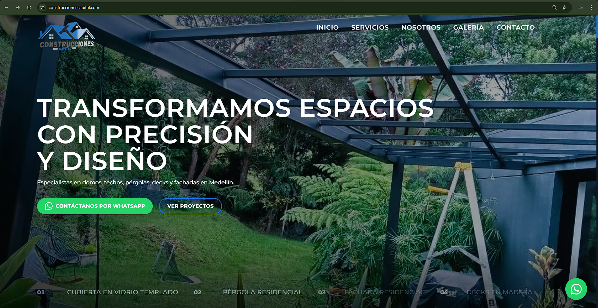

# Construcciones Capital — Corporate Website


Corporate website for **Construcciones Capital**, a Medellín-based construction company specializing in glass domes, roofing systems, pergolas, decks, and facade restoration.

🔗 **Live site:** [www.construccionescapital.com](https://www.construccionescapital.com)



---

## Overview

A single-page application with smooth scroll navigation, built as an informational corporate site (no e-commerce). The client manages all content — text, images, gallery projects, and videos — through a private admin panel without touching code.

### Key Features

- **Full-screen hero** with 3-image carousel and crossfade transitions (5.5s interval)
- **Dynamic services section** with alternating image/text layout
- **About section** with differentiators, mission, and vision — all CMS-editable
- **Masonry gallery** with category filters, lightbox navigation, and embedded YouTube videos
- **Contact section** with WhatsApp integration and social media links (Instagram, Facebook, YouTube, TikTok)
- **Embedded Google Maps** with dark-mode filter in the footer
- **Floating WhatsApp button** with pulse animation, visible site-wide
- **Admin panel** at `/admin` powered by Sanity Studio
- **Instant content updates** via Sanity webhook + on-demand revalidation (2-3 second refresh)
- **Vercel Analytics shortcut** inside Sanity Studio for the client to view site statistics

---

## Tech Stack

| Layer | Technology |
|-------|-----------|
| Framework | Next.js 16 (App Router) |
| Language | TypeScript |
| Styling | Tailwind CSS 4 |
| Animations | Framer Motion |
| CMS | Sanity v5 (headless, self-hosted Studio at `/admin`) |
| Image CDN | Sanity CDN |
| Hosting | Vercel (Hobby tier) |
| Analytics | Vercel Analytics + Speed Insights |
| SEO | Google Search Console, sitemap, Open Graph, Twitter Cards |
| Maps | Google Maps Embed API |

---

## Project Structure

```
├── app/
│   ├── admin/          # Sanity Studio (CMS panel)
│   ├── api/revalidate/ # Webhook endpoint for instant content updates
│   ├── layout.tsx      # Root layout, fonts, metadata, analytics
│   ├── page.tsx        # Main page (all sections rendered here)
│   └── sitemap.ts      # Dynamic sitemap generation
├── components/
│   ├── layout/         # Navbar, Footer
│   ├── sections/       # Hero, Services, About, Gallery, Contact
│   └── ui/             # WhatsAppButton, ScrollToTop
├── sanity/
│   ├── lib/            # Client, queries, fetch functions, image helper
│   ├── plugins/        # Analytics tool (Vercel Analytics shortcut)
│   ├── schemas/        # Content schemas (hero, services, about, projects, contact, settings)
│   └── sanity.config.ts
└── public/images/      # Static fallback images and logo
```

---

## Getting Started

### Prerequisites

- Node.js 18+
- A Sanity project (free tier works)
- A Vercel account (for deployment)

### Installation

```bash
git clone https://github.com/YOUR_USERNAME/construccionescapital-corporate-website.git
cd construccionescapital-corporate-website
npm install
```

### Environment Variables

Create a `.env.local` file in the root directory:

```env
NEXT_PUBLIC_SANITY_PROJECT_ID=your_sanity_project_id
NEXT_PUBLIC_SANITY_DATASET=production
SANITY_API_TOKEN=your_sanity_api_token
NEXT_PUBLIC_GOOGLE_MAPS_API_KEY=your_google_maps_api_key
SANITY_REVALIDATE_SECRET=your_revalidation_secret
```

### Development

```bash
npm run dev
```

Open [http://localhost:3000](http://localhost:3000) for the site and [http://localhost:3000/admin](http://localhost:3000/admin) for the CMS panel.

---

## CMS Content Management

The admin panel at `/admin` allows the client to manage:

- **Hero:** Slogan (3 editable lines), subtitle, carousel images with labels
- **Services:** Name, description, image, and display order for each service
- **About:** Company description, image, differentiators, mission, and vision
- **Gallery:** Projects with multiple images, YouTube links, categories, and sort order
- **Contact:** Section titles, address, email, and map location
- **Site Settings:** Logo, WhatsApp number, social media links (Instagram, Facebook, YouTube, TikTok), business hours

Content changes are reflected on the live site within 2-3 seconds via webhook revalidation.

---

## Deployment

The project is configured for deployment on Vercel with automatic deploys from the `main` branch.

Required environment variables must be set in the Vercel project settings (same as `.env.local` above).

---

## Design Decisions

- **Dark aesthetic:** Background variations between sections (#0f172a, #141820, #16213e) create visual separation while maintaining a cohesive dark theme
- **Proportional scaling:** Hero elements use `vh` units with `clamp()` for consistent proportions across all screen sizes
- **Single WhatsApp number:** Consolidated from the originally planned dual-number setup based on client preference
- **No Supabase:** Architecture simplified to Next.js + Sanity only; Sanity CDN handles all image storage
- **Masonry gallery:** CSS columns-based layout with staggered Framer Motion animations
- **Discrete admin access:** Footer logo links to `/admin` in a new tab — no visible "Admin" text

---

## Author

**Daniel Quintero** — Full Stack Developer

- [Linktree](https://linktr.ee/DanielEstebanQuintero)
- [LinkedIn](https://www.linkedin.com/in/danielesban/)

---

## License

This project was built under a service contract for Construcciones Capital. The source code is shared for portfolio purposes.
